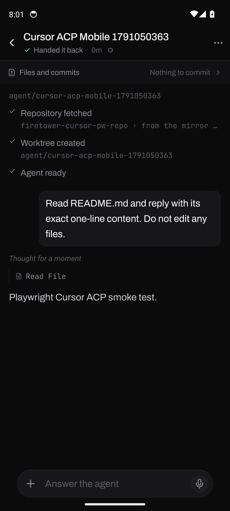
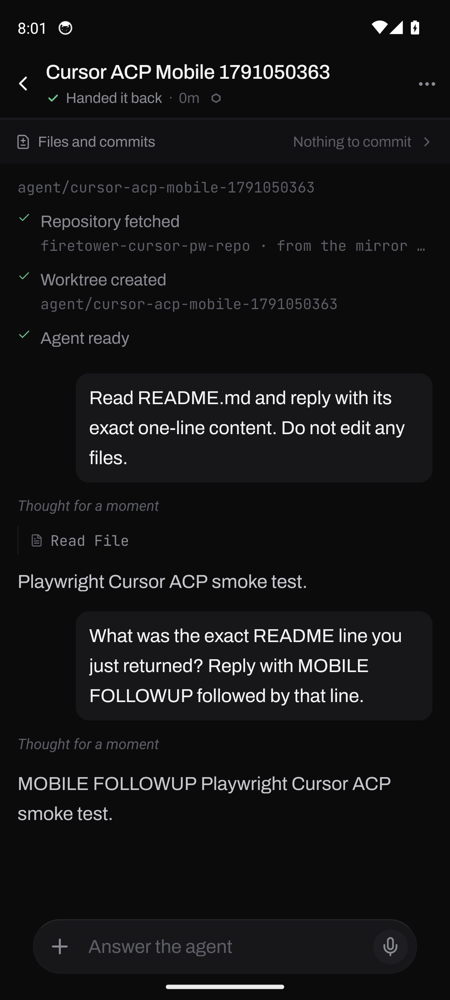

# Cursor Agent native Android evidence

On 2026-10-03, Maestro CLI 2.11.0 drove the installed Firetower development APK on a booted Pixel 8 Android 14 (API 34, arm64) emulator. This was the React Native app, not a browser viewport. The app connected through `adb reverse tcp:4400 tcp:4400` to an isolated Firetower 0.42.0 control plane and local worker rebuilt from `d1c628248519001324e6be57a4104196e895aed0`, with isolated PostgreSQL 14 and a real connected Cursor Agent subscription. Metro served the mobile source and the two accessibility IDs added by this PR. No provider or API response was mocked.

The executable flow is [`mobile/e2e/cursor-agent.yaml`](../mobile/e2e/cursor-agent.yaml). It signs in from the native app, creates a uniquely named workspace in a disposable local repository with Cursor Agent and its connected account, sends a read-only prompt, checks that the reply contains the README line, sends a memory follow-up with a distinct prefix, and checks that answer. Maestro exited `0`; the resulting session `s_01m41et22cxm5fw7j6wz1m40d4` was read back from PostgreSQL as `CursorAgent` / `HandedBack` with 15 lifecycle events.

To repeat locally, install a matching Android development build and run Metro on port 8081. On an emulator, forward 8081 and 4400 with `adb reverse`; open the development client with a URL pointing to the forwarded Metro port. Run the flow with a disposable Firetower administrator password supplied through Maestro's `-e PASS=...` parameter and a unique `-e WORKSPACE_NAME=...`. The YAML contains no credential. Save Maestro artifacts with `--test-output-dir`. The two screenshots above came from the final successful run's `takeScreenshot` commands, after their answer assertions.

The first setup attempt supplied variables only to the process environment; Maestro substituted `undefined`, so it never reached sign-in. Another attempt encountered Expo's development error overlay from an `expo-router` state-update warning. A later run failed because its exact-text assertion rejected a Cursor reply that included the correct README line with a preamble. The final flow has no overlay-dismiss command, accepts surrounding text while requiring the line, and passed from sign-in through follow-up. These failed attempts are retained as limitations, not counted as product passes. This proof covers one Android emulator and a development APK; iOS, a standalone release APK, live permission denial/approval, cancellation, expired account behavior, and longer reliability remain unproven.
